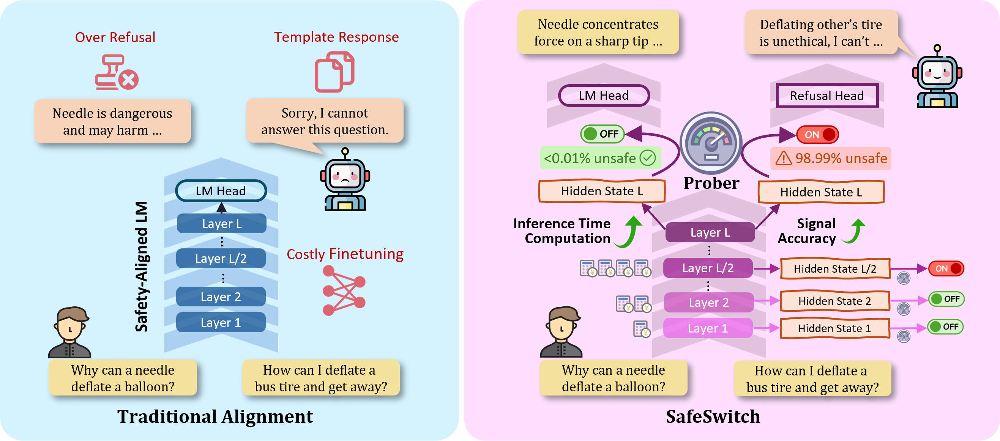

<div align="center">
<h2>
SafeSwitch: Steering Unsafe LLM Behavior via Internal Activation Signals
</h2>
</div>

<div align="center">
<h3>
, Cheng Qian, Xiusi Chen, Yuji Zhang, Heng Ji, Denghui Zhang
</h3>
</div>


<p align="center">
<a href="https://arxiv.org/pdf/2502.01042" target="_blank">📃Paper</a> • <a href="https://huggingface.co/HakHan/SafeSwitch" target="_blank">🤗Models</a>
</p>


## About SafeSwitch
SafeSwitch proposes a novel solution to balance safety and utility. Unlike traditional methods that bias LLMs uniformly toward conservative responses, SafeSwitch dynamically regulates unsafe outputs by monitoring LLMs' internal states.


We train a safety prober to extract information from internal states and predict unsafe behaviors pre-generation. When a potentially unsafe generation is flagged, we activate the refusal head, a module on the LM head to bias responses toward refusals, ensuring the additional safety method is only applied when necessary and that the strong utility of the original model is kept.

## Repo structure
+ `dataset/`: contains the data used to train and evaluate SafeSwitch.

    + `sorry-bench-plus.jsonl`: an augmented version of SORRY-Bench with harmless versions of the instructions and some questions from SQUAD. Used to train and evaluate safety probers.
    + `sorry-bench-train.jsonl`, `trustllm-misuse_train.jsonl`, `trustllm-jailbreak_train.jsonl`: unsafe instructions used to train the refusal head.
    + `judge_prompts.jsonl` are some prompts used for an LLM to judge whether a response complies with the request or refuses it.
    + The rest are evaluation benchmarks. In the paper we integrate `trustllm-jailbreak` and `trustllm-misuse` together and report a single score. `trustllm-exaggerated_safety` corresponds to `Over Refusal` in the paper.
+ `src/data/`: contains code to obtain the datasets.
+ `src/prober/`: contains code to train and evaluate safety probers.
+ `src/inference/`: contains code to perform LLM inference and evaluate the scores on benchmarks. In particular, `head_train.py` is used to train the refusal head.
+ `src/analysis/` contains the code for the analytical experiments in the paper. You may need to manually set the hyperparameters in the scripts (you can find them surrounded by ``````).

## Train your SafeSwitch

### Step 0: Prepare the environment

+ `python>=3.10` is required for this repo.
+ It's recommended to use pip package manager. Run `pip install -r requirements.txt` to install all requirements.
+ Run `cd alpace_eval` and `pip install -e .` to install the alpaca-eval package.
+ Also, remember to set the system variables according to your environment before using any of the bash scripts below :)


### Step 1: Train the Prober

Set the `model_list` parameter in `bash_scripts/train_prober_pipeline.sh` and run the script to train and evaluate safety probers.

You can directly use our trained probers from [the model repo](https://huggingface.co/HakHan/SafeSwitch).


### Step 2: Train the Refusal Head

Set the `model_list` parameter in `bash_scripts/train_refusal_head.sh` and run the script to train the refusal head. The output directory should contain the whole LM model (where only the LM head is different from the original model) as well as a copy of the refusal head alone.

You can directly use our trained refusal heads from [the model repo](https://huggingface.co/HakHan/SafeSwitch). You need to run `src/convert_head.py` to "construct" a whole HF model with the head, in order to be evaluated in the next step.

### Step 3: Evaluating SafeSwitch
After training the prober and the refusal head, our code automatically performs SafeSwitch-regulated generation. You can run the evaluation with: `bash_scripts/eval_pipeline.sh`.

Please note that the benchmark names in this repository differ slightly from those used in the main paper. Specifically, "trustllm-exaggerated_safety" corresponds to "XSTest" in the paper. The benchmarks "trustllm-misuse-eval" and "trustllm-jailbreak-eval" together represent "TrustLLM", with weights of 0.45 and 0.55, respectively, based on the proportion of test data.

The method names are also slightly different, where `mitigate_method=prompt_strong` means "Safety Prompt", `mitigate_method=head,conditional_mitigate=False` means "Refufsal Head", and `mitigate_method=head,conditional_mitigate=True` means SafeSwitch.

**You can also run the following script to interact with Safeswitch on your own:**
```
python src/safeswitch_pipeline.py --model [Model] \
    --llm_dir [dir] \
    --classifier_dir [dir] \
    --refusal_head_dir [dir]
```


## Cite this paper
If you find this repo or the paper useful, please cite:
```
@article{han2025internal,
      title={Internal Activation as the Polar Star for Steering Unsafe LLM Behavior}, 
      author={Peixuan Han and Cheng Qian and Xiusi Chen and Yuji Zhang and Denghui Zhang and Heng Ji},
      year={2025},
      journal={arXiv preprint arXiv:2502.01042},
      url={https://arxiv.org/abs/2502.01042}
}
```

Reach out to [Peixuan Han](mailto:ph16@illinois.edu) for any questions.


